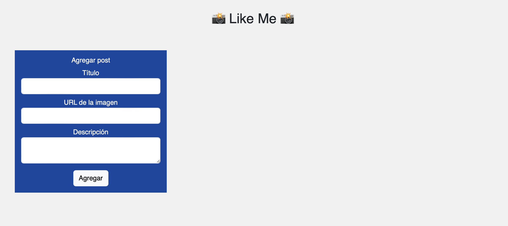
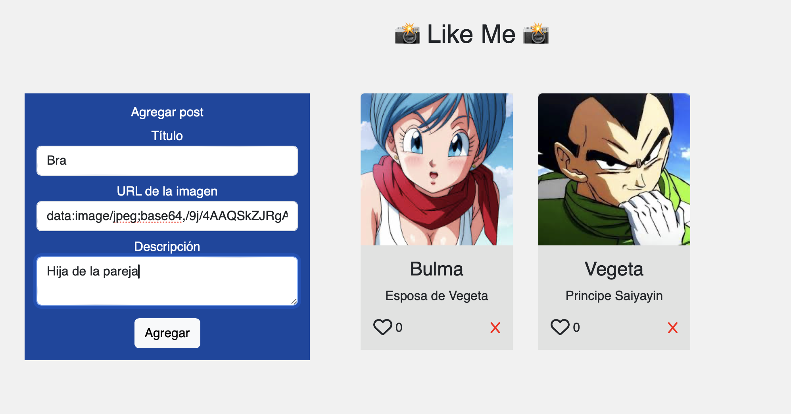
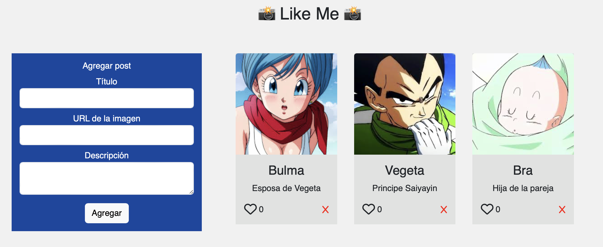
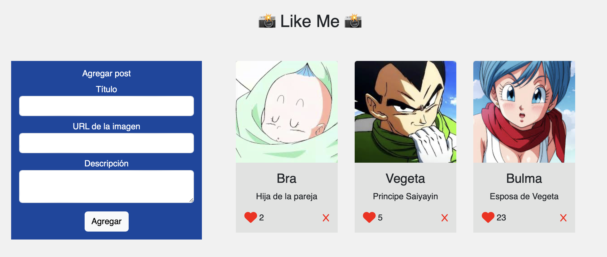
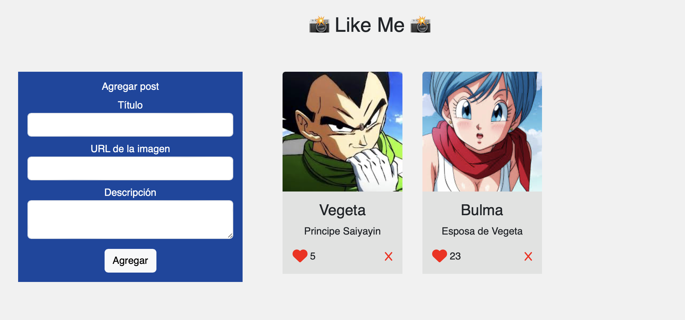

# Desafío - Like Me (P1)

Descripción:
La red social “Like Me” está apenas iniciando el proceso de desarrollo, se encuentra estudiando el mercado y analizando la competencia y ha descubierto que el éxito de esta industria se enfoca en los likes de los posts emitidos por los usuarios, por lo que decidió iniciar con el desarrollo de la lógica correspondiente a la creación de posts y a la interacción de likes que este puede tener.
En este desafío serás un desarrollador full stack developer de la empresa “Like Me” y deberás crear un servidor que disponibilice las rutas GET y POST para consultas y guardar los posts en una base de datos PostgreSQL con el paquete pg.

## Imagenes:
### Inicio

### Agregar Post

### Like al Post

### Eliminar Post

### Post Eliminado

